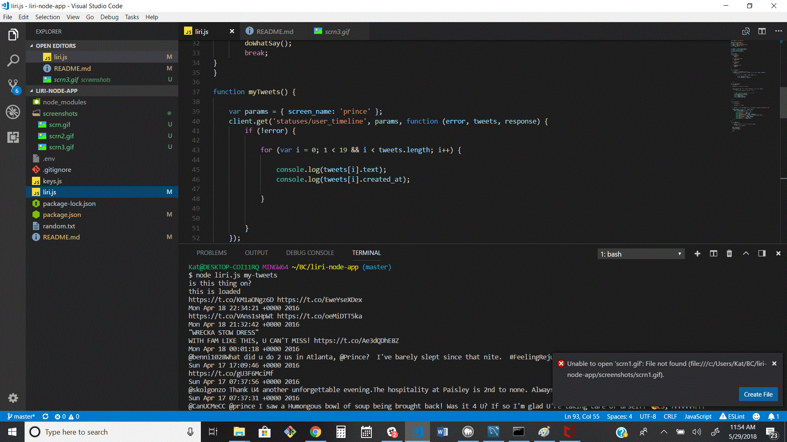
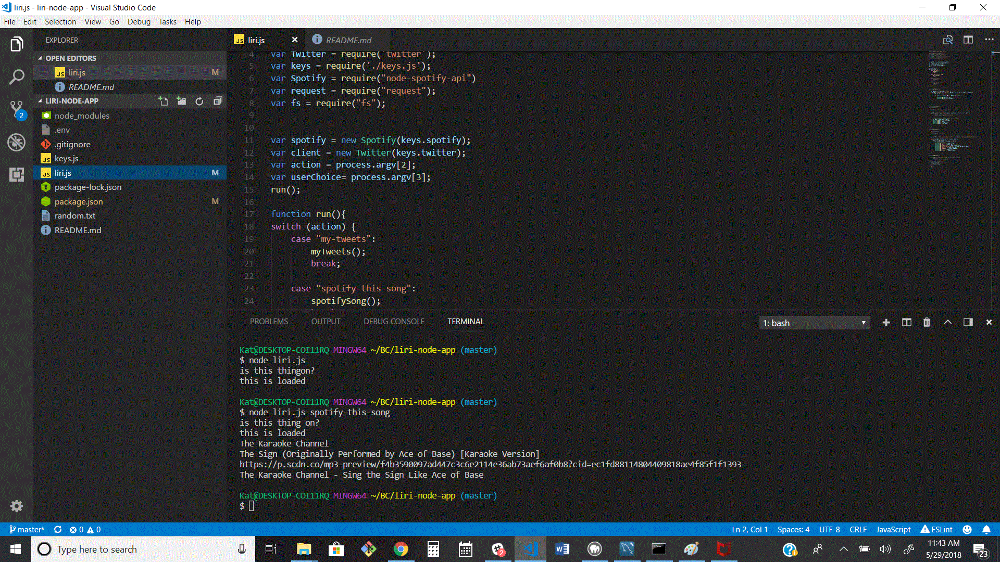
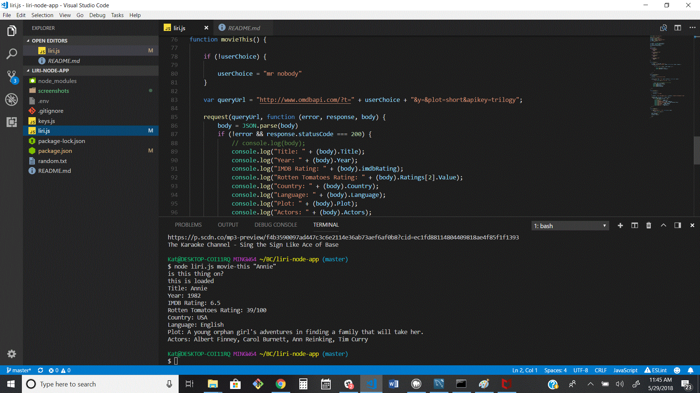
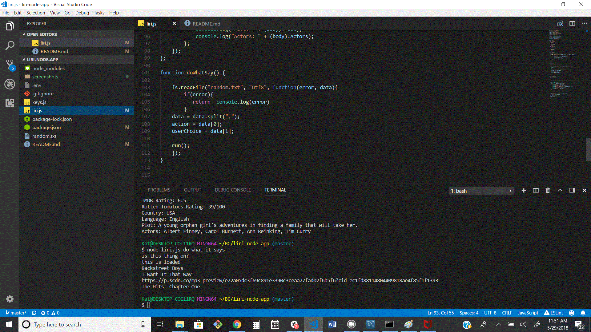

# Liri-node-app

## A Node app to search Tweets, Songs and Films

 liri.js can take in one of the following commands:
* `my-tweets`

* `spotify-this-song`

* `movie-this`

* `do-what-it-says`

What Each Command Does
node liri.js my-tweets

This will show the last 20 tweets

node liri.js spotify-this-song '<song name here>'

This will show:

Artist(s)
The song's name
A preview link of the song from Spotify
The album that the song is from
If no song is provided then Liri will default to "The Sign" by Ace of Base.

node liri.js movie-this '<movie name here>'

This will show:

   * Title of the movie.
   * Year the movie came out.
   * IMDB Rating of the movie.
   * Rotten Tomatoes Rating of the movie.
   * Country where the movie was produced.
   * Language of the movie.
   * Plot of the movie.
   * Actors in the movie.
If the user doesn't type a movie in, Liri will output data for the movie 'Mr. Nobody.'

If you haven't watched "Mr. Nobody," then you should: http://www.imdb.com/title/tt0485947/
It's on Netflix!

node liri.js do-what-it-says

Using the fs Node package, LIRI will take the text inside of random.txt and then use it to call one of LIRI's commands.

It should run spotify-this-song for "I Want it That Way," as follows the text in random.txt.

.